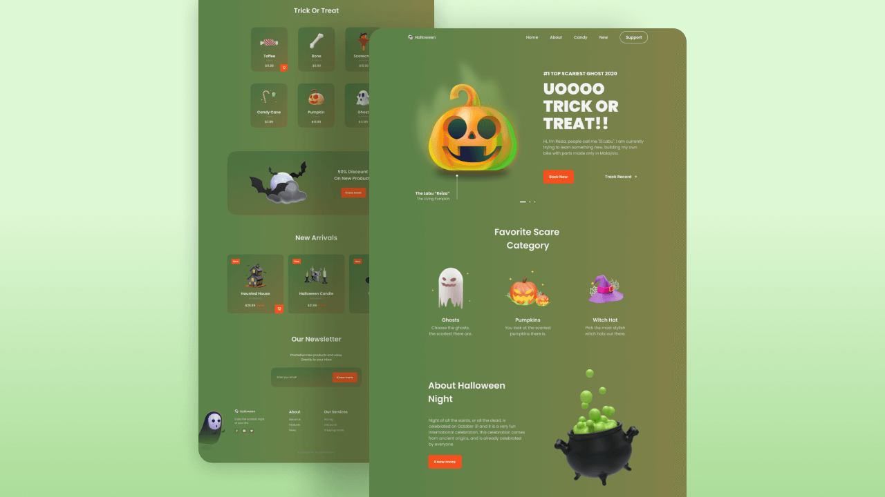

  
  
  
  

   
   

  <h2 align="center">Halloween website</h2>

  Halloween is a fully responsive website,  Responsive for all devices, built using HTML, CSS, and JavaScript.

   <a href="https://adnan-bhaldar.github.io/Halloween" target="_blank"><strong>➥ Live Demo</strong></a>

 

### Demo Screeshots

### Prerequisites

Before you begin, ensure you have met the following requirements:

* [Git](https://git-scm.com/downloads "Download Git") must be installed on your operating system.

### Features
Before you begin, here are some Halloween features
- Responsive Halloween Website Using HTML, CSS & JavaScript.
- Contains animations when scrolling.
- It has three color designs (green, red and black)
- Smooth scrolling in each section.
- Developed first with the Mobile First methodology, then for desktop.
- Compatible with all mobile devices and with a beautiful and pleasant user interface.

### Contact

If you want to contact with me you can reach me at [Twitter](https://www.twitter.com/Adnan__Bhaldar).

### License

This project is **free to use** and does not contains any license.
